# Image Quilting for Texture Synthesis & Transfer

### Course Project for CS663 - Digital Image Processing

***

This is our implementation of Texture Synthesis and Texture Transfer using Image Quilting. It is based on the [paper](./quilting.pdf) of the same name by authors Alexei Efros and William Freeman. 

## Usage

First, clone this repository using `git clone https://github.com/shubhlohiya/image-quilting-texture-synthesis.git`

#### CLI Tool:
To use the CLI tool associated with our project do the following:

* `cd code/`
* To perform Texture Synthesis use: `python main.py --synthesis -i <texture_img> -b <block_size> -o <overlap_size> -tol <tolerance>`
* To perform Texture Transfer use: `python main.py --transfer -i <target_img> -t <texture_img> -b <block_size> -o <overlap_size> -tol <tolerance> -a <alpha>`

For more details, use `python main.py -h`

&nbsp;

## Results

#### Some Results for Texture Synthesis

| **Input Image** | **Synthesized Texture**|
|:---:|:---:|
| 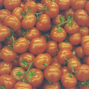 | 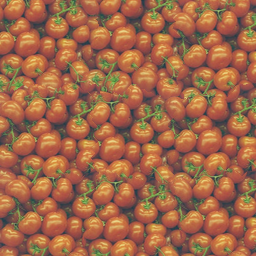 |
| 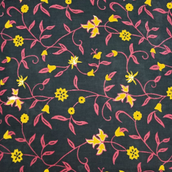 | 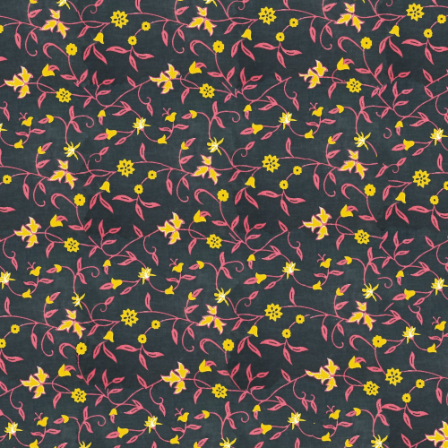 |
| 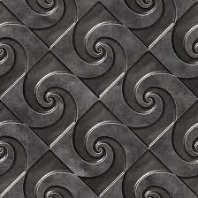 |  |
| 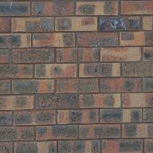 | 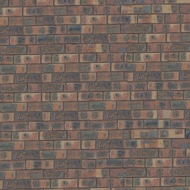 |
| 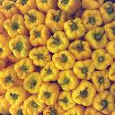 | 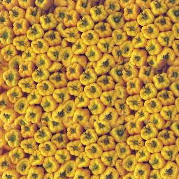 |
| 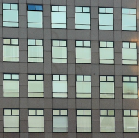 | 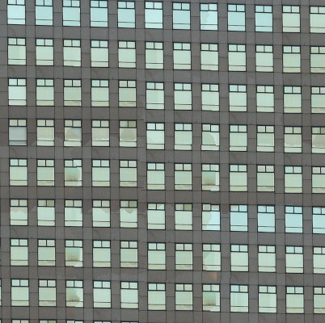 |
|  | 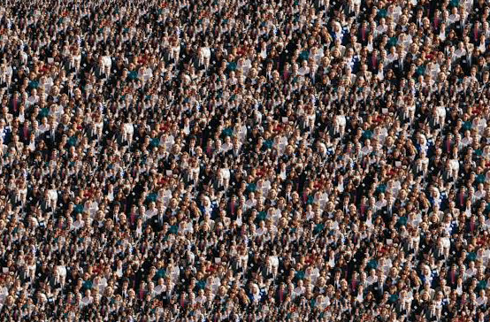 |

&nbsp;
&nbsp;
&nbsp;

#### Some Results for Texture Transfer

| **Target Image** | **Texture Image** | **Result** |
|:---:|:---:|:---:|
| 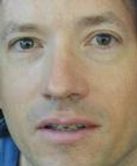 | 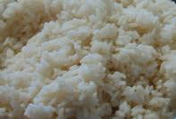 | 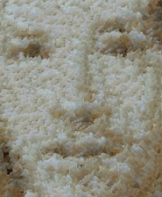|
|  | 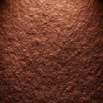 | |
|  | 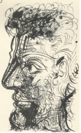 | 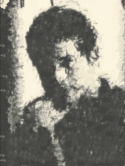|
|  | 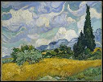 | 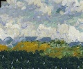|

**For more results, please check the [report](./report.pdf).**

***

Created with :heart: by <a href="https://www.linkedin.com/in/lohiya-shubham/">Shubham Lohiya</a>, <a href="https://www.linkedin.com/in/latika-patel-1951b0196/">Latika Patel</a> & <a href="https://www.linkedin.com/in/prathmesh-bele-52a05418b/">Prathmesh Bele</a>

